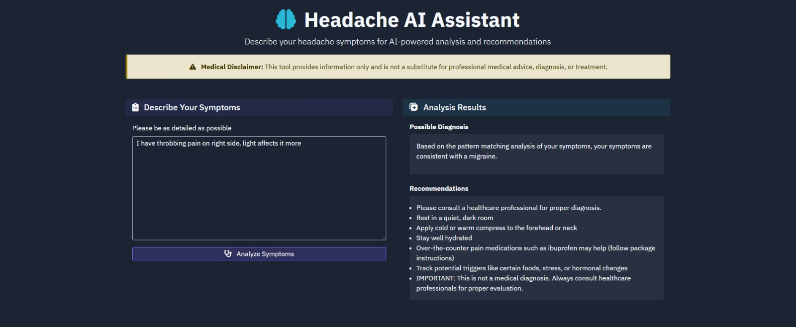

# Headache AI Assistant




A web application that uses Retrieval-Augmented Generation (RAG) and Large Language Models to analyze headache symptoms and provide recommendations.

## Features

- Analyze headache symptoms using OpenAI API
- Get diagnosis and personalized recommendations
- Reliable fallback system when AI is unavailable
- View and track your headache history
- PostgreSQL database for persistent storage

## Technologies

- **Backend**: Flask, Flask-SQLAlchemy, PostgreSQL
- **Frontend**: HTML, CSS, JavaScript, Bootstrap
- **AI Integration**: OpenAI API, RAG implementation
- **Deployment**: Replit

## Setup

1. Clone the repository
2. Install dependencies:
   ```
   pip install -r requirements.txt
   ```
3. Set up environment variables:
   - `DATABASE_URL`: PostgreSQL connection string
   - `OPENAI_API_KEY`: Your OpenAI API key
   - `SESSION_SECRET`: Secret key for Flask session

4. Initialize the database:
   ```
   flask db init
   flask db migrate
   flask db upgrade
   ```

5. Run the application:
   ```
   gunicorn --bind 0.0.0.0:5000 main:app
   ```

## Usage

1. Enter your headache symptoms in the text area
2. Click "Analyze Symptoms" to get diagnosis and recommendations
3. View your history of headache records on the History page

## Disclaimer

This application is for informational purposes only and is not a substitute for professional medical advice, diagnosis, or treatment. Always seek the advice of your physician or other qualified health provider with any questions you may have regarding a medical condition.

## License

[MIT License](LICENSE)
